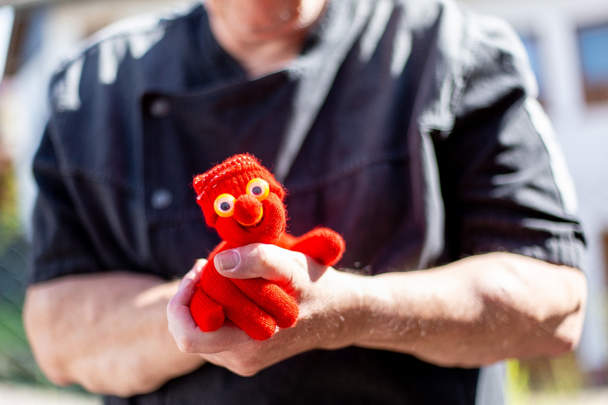

# Nasreddins-Story
The story behind all.... Nasr ad-Din al-Quffaz (Nasreddin the Glove)

## Who or What Is Nasreddin?

Nasreddin Hodja (also known as Nasreddin, Nasreddin Hoca, or Nasreddin Hodja) is a legendary figure from Turkish, Persian, and Arabic folklore. He is known as a folk philosopher, storyteller, and jester who teaches everyday wisdom with humor and surprising twists.

The tales of Nasreddin date back to the 13th century and are widespread across many countries. You can read more about him here: [https://en.wikipedia.org/wiki/Nasreddin](https://en.wikipedia.org/wiki/Nasreddin)

## Nasr ad-Din al-Quffaz (Nasreddin the Glove)

When the trick **Mr. Gloves** by [Juan Pablo](https://www.penguinmagic.com/magician/juan-pablo), an Argentinian Magician and inventor of magic tricks, was released, I bought it immediately.
(Review: [https://www.youtube.com/watch?v=njTG4mPjbsg](https://www.youtube.com/watch?v=njTG4mPjbsg))
(Source: [https://secret-magic-store.de/collections/zoom-meeting-06-02-2024/products/mr-gloves-juan-pablo](https://secret-magic-store.de/collections/zoom-meeting-06-02-2024/products/mr-gloves-juan-pablo))

The character wears a distinctive hat – which inspired us to name him **Nasr ad-Din al-Quffaz (نصر الدين القفاز)**, roughly translating to *Nasreddin the Glove*. That’s also where this project’s name came from.

Believe me, he truly embodies Nasreddin Hodja’s spirit when he performs! His antics are often reminiscent of the old tales of his namesake.

In the picture, you can see one version of Nasreddin. The original glove by Juan Pablo can get quite warm — especially in summer. So, I built my own version of Juan’s *Mr. Gloves*, including several gimmick variations.

You can also see that I use a different type of eyes — finger eyes that you can buy in toy stores. They’re a fun alternative to the original trick’s eyes. They’re cheap, and sometimes Nasreddin even gives some away to children... (You can get a pack of 100 quite cheaply from China. Since I don’t need all colors, there are always happy recipients for the extras.)

## more

And as you can already see from this repository, Nasreddin and I (Peter Heß) have become something like a well-rehearsed team. Nasreddin has already appeared in museums, at street festivals, family celebrations, and sometimes just casually out on the street with Peter. Nasreddin doesn’t speak — but he acts. Peter, on the other hand, does all the talking. We argue about who the better magician is. Nasreddin tends to exaggerate things quite a bit. He’s certainly doing his best to live up to his namesake.

By now, he even has his own business cards, a whole box of magical props, and something of a small fan community.

And of course, he is the namesake of the magic projects on Peter’s GitHub.
